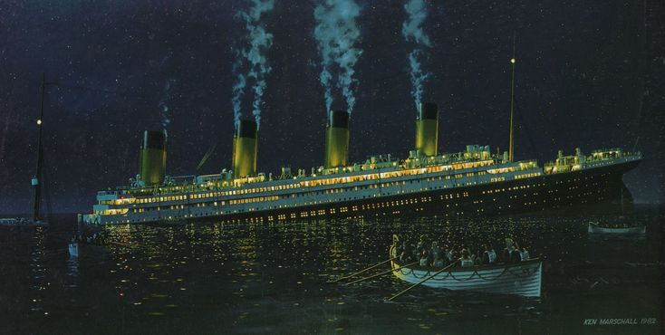

# Titanic-Survivor-Prediction-Classification

Basic Data Science project in which several classification machine learning models are applied to the passenger list of the titanic 
with the survivors yes (1) or no (0) as the target values.

  * The jupyter notebook file `project_titanic.ipynb` contains the entire code of this project
  * The file `data.csv` contains the passenger list of the titanic

Link to the kaggle challange [https://www.kaggle.com/c/titanic]
